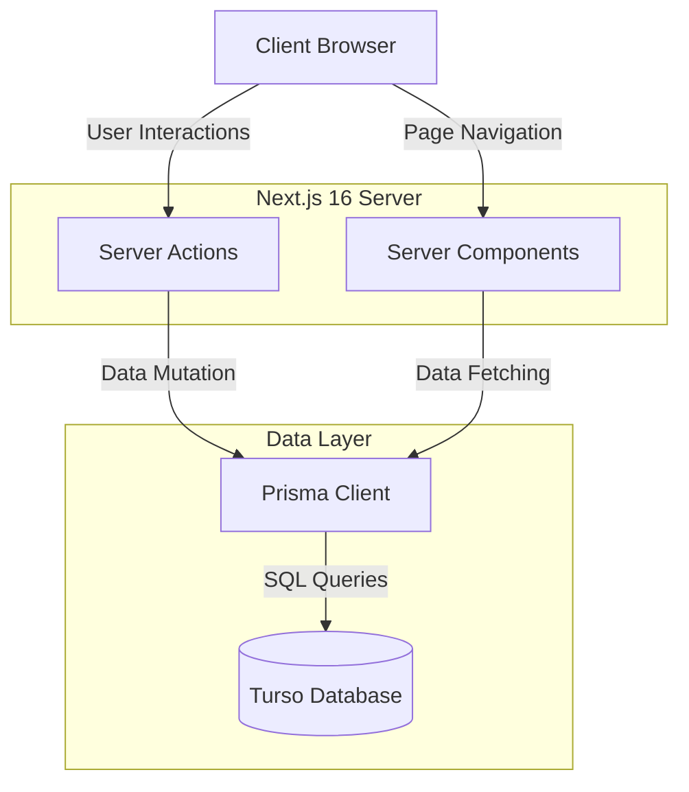

# Emotion Diary

<div align="center">
  <h3>AI 기반 감정 기록 다이어리 & 무드 트래커</h3>
  <p>Next.js 16, React 19, Turso로 구축된 최신 웹 애플리케이션</p>

  <div>
    
    
    
    
    
    
  </div>
</div>

<br />

## 📋 프로젝트 소개 (About The Project)

**Emotion Diary**는 사용자가 매일의 감정을 기록하고 추적할 수 있는 반응형 웹 애플리케이션입니다.

이 프로젝트는 단순한 일기장 구현을 넘어, **React 생태계의 최신 기술(Next.js 16, React 19)**을 탐구하고 **Edge-ready 데이터베이스(Turso)**를 실무에 도입해보기 위해 시작되었습니다.

### 주요 기능 (Key Features)

- **일기 작성**: 하루의 생각과 감정을 기록, 수정, 삭제할 수 있는 에디터 제공.
- **감정 추적 (Mood Tracking)**: 그날의 기분을 시각적인 아이콘으로 선택 및 저장.
- **데이터 시각화**: `Recharts`를 활용하여 주간/월간 감정 흐름을 차트로 한눈에 파악.
- **반응형 디자인**: `Tailwind CSS v4`를 사용하여 모바일 및 데스크톱 환경 모두 최적화.

---

## 🏗️ 기술적 의사결정 (Technical Deep Dive)

이 프로젝트는 최신 풀스택 아키텍처를 실무 수준으로 구현하는 데 중점을 두었습니다.

### 기술 스택 (Tech Stack)

| 구분          | 기술                        | 선택 이유                                                                                            |
| ------------- | --------------------------- | ---------------------------------------------------------------------------------------------------- |
| **Framework** | **Next.js 16 (App Router)** | Server Components 및 최신 Server Actions를 활용하여 데이터 처리를 간소화하고 성능을 최적화하기 위함. |
| **Language**  | **TypeScript**              | 컴파일 단계에서 오류를 잡고, Prisma와 연동하여 완벽한 Type-safety를 보장받기 위함.                   |
| **Database**  | **Turso (LibSQL)**          | 기존 RDB 대비 낮은 지연 시간(Low Latency)과 엣지 컴퓨팅 환경에서의 높은 호환성 때문에 선택.          |
| **ORM**       | **Prisma**                  | 데이터베이스 스키마 관리(Migration)가 용이하고, 직관적인 쿼리 인터페이스 제공.                       |
| **Styling**   | **Tailwind CSS v4**         | 별도의 런타임 오버헤드 없이 빠른 스타일링이 가능하며, v4의 최신 기능을 실험해보기 위함.              |

### 시스템 아키텍처

클라이언트 사이드 자바스크립트를 최소화하기 위해 서버 중심(Server-centric) 아키텍처를 채택했습니다.



---

## 🚀 시작하기 (Getting Started)

로컬 환경에서 프로젝트를 실행하는 방법입니다.

### 사전 준비 (Prerequisites)

- Node.js 18 버전 이상
- npm, yarn, pnpm, 또는 bun 패키지 매니저

### 설치 방법 (Installation)

1. **리포지토리 클론**

   ```bash
   git clone https://github.com/woosung-dev/Emotion-Diary.git
   cd emotion-diary
   ```

2. **의존성 설치**

   ```bash
   npm install
   # 또는
   pnpm install
   ```

3. **환경 변수 설정**
   루트 디렉토리에 `.env` 파일을 생성하고 다음 값을 입력합니다:

   ```env
   TURSO_DATABASE_URL="libsql://your-db-name.turso.io"
   TURSO_AUTH_TOKEN="your-auth-token"
   ```

4. **데이터베이스 초기화**

   ```bash
   npx prisma generate
   npx prisma db push
   ```

5. **개발 서버 실행**

   ```bash
   npm run dev
   ```

   브라우저에서 [http://localhost:3000](http://localhost:3000)으로 접속하여 확인합니다.

---

### 트러블 슈팅 (Challenges & Solutions)

#### 1. Next.js 16 & React 19 도입

- **문제점**: 기존 `useEffect` 기반의 클라이언트 사이드 데이터 페칭에 익숙해져 있어, 서버 컴포넌트로의 전환에 적응이 필요했습니다.
- **해결**: Form 제출 및 모든 데이터 변이(Mutation) 로직을 **Server Actions**로 전면 교체했습니다. 이를 통해 별도의 API Route를 작성할 필요가 없어져 코드가 간결해졌고, 클라이언트 번들 사이즈도 줄일 수 있었습니다.

#### 2. 데이터베이스 지연 시간 (Latency)

- **고민**: Next.js의 Edge 런타임과 호환되면서도 빠른 응답 속도를 가진 DB가 필요했습니다.
- **해결**: 기존 PostgreSQL 대신 **Turso (LibSQL)**을 도입했습니다. HTTP 기반의 가벼운 프로토콜 덕분에 Serverless 환경에서의 콜드 스타트 오버헤드가 현저히 적음을 확인했습니다.

### 향후 개선 계획 (Future Improvements)

- **AI 감정 분석**: OpenAI API를 연동하여 사용자의 일기 내용을 분석하고 위로의 한마디를 건네는 기능 추가.
- **인증 고도화**: 현재 데모 버전이므로, Auth.js 또는 Clerk를 도입하여 사용자별 데이터 격리 및 보안 강화.
- **캘린더 뷰**: 월별 감정 흐름을 직관적으로 볼 수 있는 달력 UI 구현.

---

## 📬 문의 (Contact)

**Woosung** - [GitHub Profile](https://github.com/woosung-dev)

_Project Link: [https://github.com/woosung-dev/Emotion-Diary](https://github.com/woosung-dev/Emotion-Diary)_
